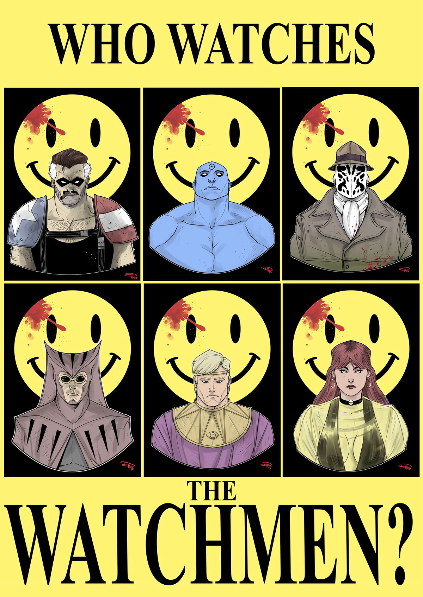

# Proposal processor factory

In this task we'll analyze the [FundraisingServiceRestApi.java](..%2Fsrc%2Fmain%2Fjava%2Fpl%2Fwojtyna%2Ftrainings%2Fdesignpatterns%2Fproblems%2Fcrowdsorcery%2Ftask5%2Fcontrollers%2FFundraisingServiceRestApi.java).

## Problems
In task 4 we introduced the composite pattern combined with strategy to allow processing proposals in different ways. There is one little problem, though. Who decides how to build this composite? After all, this might require quite a lot of work and some serious business logic might be involved. [FundraisingService.java](..%2Fsrc%2Fmain%2Fjava%2Fpl%2Fwojtyna%2Ftrainings%2Fdesignpatterns%2Fproblems%2Fcrowdsorcery%2Ftask5%2Fservices%2FFundraisingService.java) is not responsible for this decision. This would undermine the whole point of introducing the strategy pattern.

As you can see, we decided to push this responsibility to the direct client of the fundraising service - the [FundraisingServiceRestApi.java](..%2Fsrc%2Fmain%2Fjava%2Fpl%2Fwojtyna%2Ftrainings%2Fdesignpatterns%2Fproblems%2Fcrowdsorcery%2Ftask5%2Fcontrollers%2FFundraisingServiceRestApi.java) class. This is not a good solution. This class is already responsible for too many things, mixing presentation logic with business logic required to choose the right strategy. Even worse, if we decided to introduce another client (e.g. gRPC) of the fundraising service, we would have to duplicate this logic.

It's time to make it right.

## Your task
Extract the responsibility of creating proposal processors from the fundraising service controller, so you can easily change the factory logic without affecting the clients.

### Solution
As always, you can find the solution in the `solutions.crowdsorcery.task5` package. You can follow the `patterns.AbstractFactoryPattern` annotation.

## Discussion
- How did the introduction of the factory affect the number of test cases that need to be verified when interacting with REST endpoint?
- How many classes need to be changed when making totally different decision (e.g. based on tenant) regarding choosing the proposal processor?
- And finally... Who creates the factory? In other words, "Who watches the watchmen"? ;) 