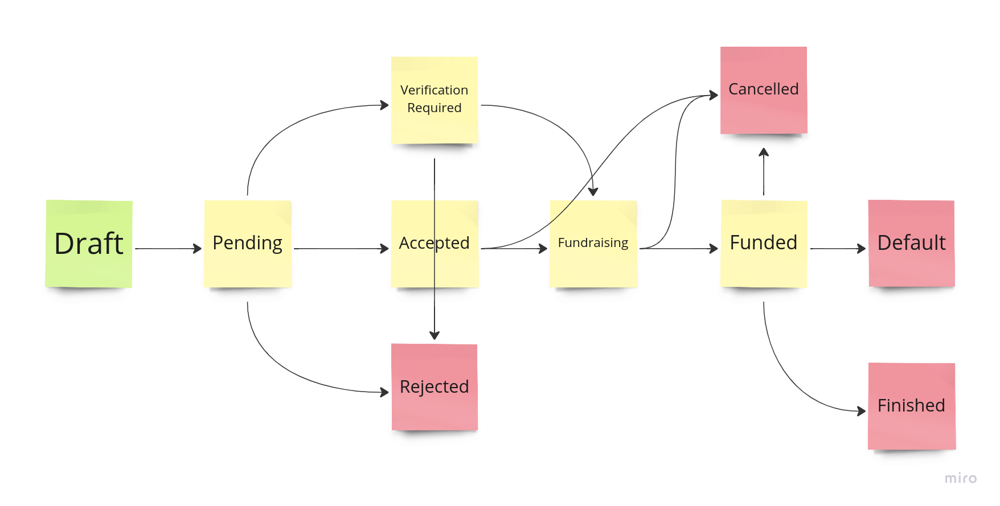

# Portfolio builder

Let's take a look at the
[FundraisingService.java](..%2Fsrc%2Fmain%2Fjava%2Fpl%2Fwojtyna%2Ftrainings%2Fdesignpatterns%2Fproblems%2Fcrowdsorcery%2Ftask9%2Fservices%2FFundraisingService.java)

## Problems
Fundraising service is responsible for managing transitioning between project states. Transition rules might get more and more complex over time. Plus, there will be more states we will need to support very soon. The current implementation also allows for invalid transitions. We need to make sure that the transition is valid before we execute it. For example, imagine creating another service that violates encapsulation and accesses states directly; this service would need to repeat the same transitions rules used in the fundraising service. Very soon, our code would be a nightmare to maintain.

## Your task
Apply the State Pattern to encapsulate transition rules within concrete project state objects.

Here are the states and the transition rules you need to implement:

### Solution
As always, you can find the solution in the `solutions.crowdsorcery.task9` package. You can follow the `@StatePattern` annotation.

## Discussion
- What are the benefits of using the State Pattern?
- What are the drawbacks of using the State Pattern?
- Is it easy to add new state?
- Is it easy to add a new method to the project class and handle it within multiple states?
- Is flow easier or harder to follow?
- When we should avoid using the State Pattern?
- Is there any way we could enforce our clients to be able to call only valid operations in a given state? For example, we might want to allow only accept and reject operations in the `PENDING` state.